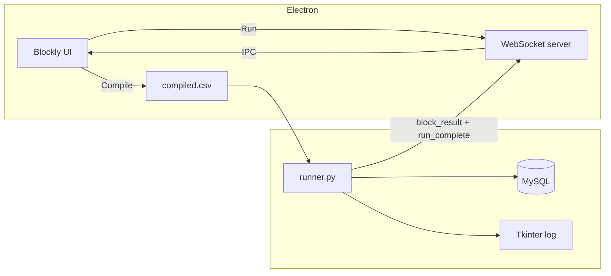

# SMH Coders – Blockly assignment (Electron + Python + MySQL)

Visual programs are built in **Blockly**, **compiled** to `compiled.csv`, then **run** by a Python interpreter that talks to **MySQL** and streams execution results over **WebSocket** back to Electron so blocks are colored (success, failure, skipped).

## Contents

- [Features](#features)
- [Repository layout](#repository-layout)
- [Architecture](#architecture)
- [Prerequisites](#prerequisites)
- [Quick start](#quick-start)
- [Configuration](#configuration)
- [Using the app](#using-the-app)
- [CSV format (compiler output)](#csv-format-compiler-output)
- [Expression AST (`params`)](#expression-ast-params)
- [Python runner (CLI)](#python-runner-cli)
- [Troubleshooting](#troubleshooting)
- [Submission packaging](#submission-packaging)

## Features

- **Blockly workspace** with blocks for variables (`x`, `y`, `z`), math expressions, `if` / `else`, `repeat`, and `fetch DB` (single `SELECT` on `test_table`).
- **Compile** writes `electron/csv_output/compiled.csv` (JSON in the `params` column).
- **Run** starts a local WebSocket server, runs `backend/runner.py` on the CSV, then applies per-block status (green / red / gray) from WebSocket messages.
- **Tkinter** execution log window after the run (Python).
- **MySQL** via PyMySQL; credentials from repo-root **`.env`** only (not committed).

## Repository layout

| Path | Role |
|------|------|
| `electron/` | Electron shell: `main.js`, `preload.js`, `renderer.js` (Blockly), `styles.css`, `index.html` |
| `electron/csv_output/` | Created at runtime; **`compiled.csv`** is written on **Compile** (gitignored) |
| `backend/` | `runner.py` (interpreter + WebSocket client), `executor.py`, `db.py`, `ui.py` |
| `backend/requirements.txt` | Python dependencies |
| `test_table.sql` | Sample schema + data (`test_database`, `test_table`) |

## Architecture



On **Run**, a **random free port** is chosen; the WebSocket URL is passed to Python as `--ws`. The runner executes the CSV, then connects and sends one JSON message per block result, then `run_complete`.

## Prerequisites

- **Node.js** (LTS) and **npm**
- **Python** 3.12+
- **MySQL** or **MariaDB** (e.g. XAMPP)

## Quick start

### 1. Database

Import **`test_table.sql`** into your MySQL server (creates `test_database` and `test_table`).

### 2. Environment file

At the **repository root** (next to this `README.md`), create **`.env`** (never commit it):

```env
MYSQL_HOST=127.0.0.1
MYSQL_PORT=3306
MYSQL_USER=root
MYSQL_PASSWORD=
MYSQL_DATABASE=test_database
```

Adjust user/password to match your server (XAMPP often uses `root` with an empty password).

### 3. Python virtual environment

From the **repository root**:

```powershell
cd backend
python -m venv .venv
.\.venv\Scripts\Activate.ps1
pip install -r requirements.txt
```

On macOS/Linux:

```bash
cd backend
python3 -m venv .venv
source .venv/bin/activate
pip install -r requirements.txt
```

### 4. Electron app

```bash
cd electron
npm install
npm start
```

Use **Refresh paths** to confirm paths to `csv_output`, `backend`, and `runner.py`. Build a program, **Compile**, then **Run**.

## Configuration

| Variable | Purpose |
|----------|---------|
| `MYSQL_HOST` | Database host |
| `MYSQL_PORT` | Port (default `3306`) |
| `MYSQL_USER` | MySQL user |
| `MYSQL_PASSWORD` | Password (may be empty) |
| `MYSQL_DATABASE` | Database name (e.g. `test_database`) |

`runner.py` loads **only** `../.env` relative to the `backend/` folder (i.e. repo root `.env`).

## Using the app

1. Drag blocks from the flyout and connect **statement** blocks into stacks.
2. **Compile** — validates the program and saves **`electron/csv_output/compiled.csv`**.
3. **Run** — executes via Python; watch the status area and block colors; a **Tkinter** window shows a line-by-line trace.

**Tips**

- `fetch DB` expects a single **SELECT** that references **`test_table`**. Put only SQL in the query field (the block label already says “fetch DB”).
- Close **`compiled.csv`** in Excel or other apps before **Run** if you see a file-lock (**EBUSY**) error.

## CSV format (compiler output)

**Header:** `block_id,block_type,params,order_index`

- **`block_id`** — Blockly block id (string).
- **`block_type`** — Opcode for the interpreter (see table below).
- **`params`** — JSON object (see [Expression AST](#expression-ast-params) where used).
- **`order_index`** — Execution order (1-based).

| `block_type` | Meaning |
|--------------|---------|
| `set_var` | Assign variable (`name`, `value` expr). |
| `fetch_db` | Run validated `SELECT` (`query` string). |
| `if_start` | Evaluate condition (`left`, `operator`, `right` exprs). |
| `else_start` | Start else branch (structural; pairs with `if_start`). |
| `if_end` | End if/else (structural). |
| `loop_start` | Begin loop (`count` as number expr, 1–100). |
| `loop_end` | End loop / back-edge for repeat. |

Condition `operator` values: `>`, `<`, `==`, `>=`, `<=`.

## Expression AST (`params`)

Used for math, variable reads, and condition sides.

| `kind` | Fields |
|--------|--------|
| `number` | `value` (number) |
| `var` | `name` — `x`, `y`, or `z` |
| `binop` | `op`: `add` \| `subtract` \| `multiply` \| `divide`; `left`, `right` (nested expr objects) |

## Python runner (CLI)

The Electron app normally invokes:

```text
python runner.py --csv "<absolute path to compiled.csv>" --ws "ws://127.0.0.1:<port>"
```

Working directory should be **`backend/`** so `import executor` resolves. Use the venv Python:

**Windows**

```powershell
cd backend
.\.venv\Scripts\python.exe runner.py --csv "D:\path\to\electron\csv_output\compiled.csv" --ws "ws://127.0.0.1:8765"
```

You must have a WebSocket server listening on that URL if you run manually (the Electron app starts the server for you).

Dependencies (`requirements.txt`): `pymysql`, `websockets`, `python-dotenv`.

## Troubleshooting

| Issue | What to try |
|--------|-------------|
| `Missing MySQL env vars` | Ensure **`.env`** exists at **repo root** and contains all `MYSQL_*` keys. |
| `Unknown database 'test_database'` | Import **`test_table.sql`** or create the database manually. |
| `compiled.csv is locked (EBUSY)` | Close the file in Excel or another program; retry **Run**. |
| `Only SELECT queries are allowed` | Query must start with `SELECT` (after trimming); must reference `test_table`. |
| `Variable x used before set` | Assign with **set** before **get** in execution order. |
| Blocks stay default color | Ensure **Run** finished; check status text for errors. |
| WebSocket / Python errors | Run from terminal with `npm start` and watch the Electron console for `[python stderr]`. |

## Submission packaging

### What reviewers need to run your project

1. Install **Node.js**, **Python 3.12+**, and **MySQL**.
2. Clone or extract your archive and `cd` into the project folder.
3. Import **`test_table.sql`**.
4. Create **`.env`** at the repo root (see [Quick start](#quick-start)).
5. `cd backend && python -m venv .venv` → activate → `pip install -r requirements.txt`.
6. `cd electron && npm install && npm start`.

### What to include in a submission zip

**Include**

- All **source** files: `electron/`, `backend/`, `test_table.sql`, `README.md`, `.gitignore`.
- **`electron/package.json`** and **`electron/package-lock.json`** (if you use lockfile).

**Do not include** (regenerate locally)

- `node_modules/`
- `backend/.venv/` or any `venv/`
- **`.env`** (secrets) — reviewers create their own from the template in this README.
- `electron/csv_output/` or generated `compiled.csv` (optional; can be omitted as gitignored).
- `__pycache__/`, `.DS_Store`

### Automated zip from Git (recommended)

If the project is a Git repository, from the **repository root**:

**Windows (PowerShell)**

```powershell
.\scripts\package-submission.ps1
```

This writes a **timestamped** `smh-blockly-assignment-submission-YYYYMMDD-HHmm.zip` in the repo root using `git archive` (tracked files only — excludes `node_modules` and other ignored artifacts).

**Manual `git archive`**

```bash
git archive --format=zip -o smh-blockly-assignment-submission.zip HEAD
```

### Demo checklist (optional)

- [ ] Show **Compile** saving successfully.
- [ ] Show **Run** with block coloring (green / red / gray) and status lines.
- [ ] Show **Tkinter** log with expected opcodes.
- [ ] Show a **fetch DB** block returning data from `test_table`.

## License / use

Private academic / hiring use unless SMH Coders states otherwise.
